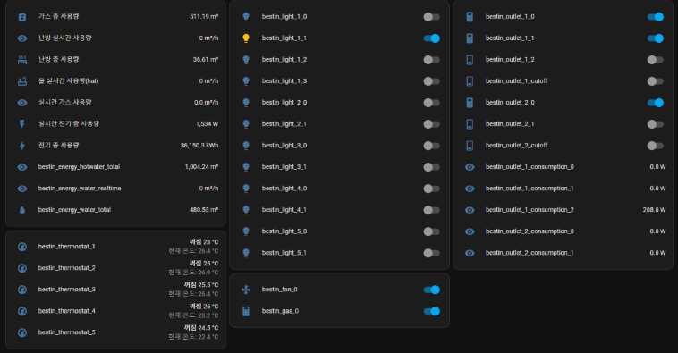

[](https://github.com/hacs/integration)

# BESTIN
BESTIN 월패드 1.0/2.0 사용자들을 위한 통합

## 기여
문제가 있나요? [Issues](https://github.com/lunDreame/ha-bestin/issues) 탭에 작성해 주세요.

- 테스트 중이며, 다양한 환경에서의 테스트 케이스가 필요합니다.
- 월패드 버전 3.0의 테스트 되지 않았으며 확인이 필요합니다. 도움이 필요하신 분은 이슈 및 디버깅 탭에 메일 주소로 연락 주세요.
- 시리얼 통신의 경우 테스트 되지 않았습니다.
- 더 좋은 아이디어가 있나요? [Pull requests](https://github.com/lunDreame/ha-bestin/pulls)로 공유해 주세요!
- 이 통합을 사용하면서 발생하는 문제에 대해서는 책임지지 않습니다.

도움이 되셨나요? [카카오페이](https://qr.kakaopay.com/FWDWOBBmR) [토스](https://toss.me/lundreamer)

## 설치
[](https://my.home-assistant.io/redirect/hacs_repository/?owner=lunDreame&repository=ha-bestin&category=Integration)

이 통합을 설치하려면 이 GitHub Repo를 HACS Custom Repositories에 추가하거나 위의 배지를 클릭하세요. 설치 후 HomeAssistant를 재부팅하세요.

1. **기기 및 서비스** 메뉴에서 **통합구성요소 추가하기**를 클릭합니다.
2. **브랜드 이름 검색** 탭에 `BESTIN`을 입력하고 검색 결과에서 클릭합니다.
3. 아래 설명에 따라 설정을 진행합니다:
    - **설정 전에 로컬 통신 스마트홈 연동 둘 다 진행하는 경우 로컬 통신 설정 이후에 스마트홈
    연동을 진행해 주세요.**
    - 스마트홈 연동을 먼저 하는 경우 엔트리가 잘못 설정되어 제대로 기기가 생성되지 않습니다. 버그로 추정되며 수정전까지 위 방법으로 설정해 주세요.

   #### 1. 로컬 통신 설정
   - **IP 주소** 입력:
     - **EW11** 사용 시: `192.168.x.x` 형식의 IP 주소 입력
     - **USB to 485** 사용 시: `/dev/ttyXXX` 경로 입력
   - **포트** 입력:
     - **EW11** 사용 시: 포트 번호 입력 (기본값: 8899)
     - **USB to 485** 사용 시: 이 항목은 생략합니다.

   #### 2. 스마트홈 연동 설정
   - **스마트홈 연동**을 원할 경우, 제공된 문서를 참고하여 설정을 구성합니다.

4. 설정이 완료된 후, 컴포넌트가 로드되면 생성된 기기를 사용하실 수 있습니다.

### 준비
- EW11 or USB to 485 컨버터 2개 (게이트웨이 없는 일체형 세대는 한 개로 사용 가능)
- 라인 확보 및 게이트웨이 타입 구분 (게이트웨이 있는 세대인지 월패드 뒤쪽 라인에 꼽히는지 확인)
- 통신기 `EW11 or USB to 485` 설치 (자세한 내용은 [여기](./guide/install.md) 참조)

  - 정상적으로 연결되었는지 확인하려면 시리얼 포트몬 프로그램을 통해 시리얼 데이터 확인. BESTIN 월패드의 경우 02로 시작하며 [예시 데이터](./guide/packet_dump.txt) 참조
  - 디밍 세대의 경우 [해당](./guide/dimming_packet_dump.txt) 데이터 참조

## 기능


| 기기      | 지원 | 속성                          |
|-----------|------|-------------------------------|
| 콘센트    | O    | 실시간 사용량, 대기전력자동차단 |
| 조명      | O    | 디밍, 색온도                   |
| 엘리베이터 | O    | 2.0의 경우 지원                |
| HEMS      | O    | 실시간, 총합 사용량            |
| 환기      | O    | 프리셋 (자연풍)                 |
| 가스      | O    |                               |
| 도어락    | O    |                               |
| 난방      | O    |                               |

- 추가 기기나 속성이 필요하면 이슈 탭에 등록해 주세요.
- 1.2.0 버전 이후부터 IPARK 스마트홈 연동을 지원합니다.

## 디버깅
문제 파악을 위해 아래 코드를 `configuration.yaml` 파일에 추가 후 HomeAssistant를 재시작해 주세요.
BESTIN 구성요소의 디버그 로깅을 활성화하고 생성된 파일을 이슈 등록 시 첨부해 주세요. 개인정보가 우려되는 경우 [이메일](lundreame34@gmail.com)로 연락 부탁드립니다.

```yaml
logger:
  default: info
  logs:
    custom_components.bestin: debug
```

## 라이선스
BESTIN 통합은 [Apache License](./LICENSE)를 따릅니다.
